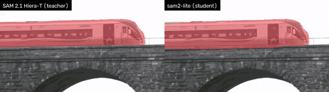
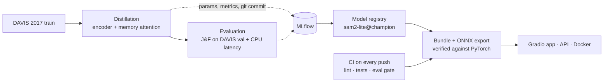

# sam2-lite

**SAM 2.1 video object segmentation 2.1× faster on CPU: a distilled mobile image encoder plus a memory attention distilled to attend to fewer frames, measured end to end, with every number traceable to an MLflow run.**

[](https://github.com/pablopigue/sam2-lite/actions/workflows/ci.yml)

<p align="center"></p>
<p align="center"><sub>sam2-lite tracking a swan family from a single click. Video: <a href="https://commons.wikimedia.org/wiki/File:Trumpeter_swan_family.webm">"Trumpeter swan family"</a> by Lorie Shaull, <a href="https://creativecommons.org/licenses/by/2.0">CC BY 2.0</a>, cut and with masks drawn.</sub></p>

**Model:** [Pablopigue/sam2-lite](https://huggingface.co/Pablopigue/sam2-lite) on the Hugging Face Hub (safetensors bundle + ONNX encoders).

**Try it locally:** a Gradio app (`make app`), an HTTP API with a minimal web page (`make api`) and a CPU Docker image (`make docker-build && make docker-run`); see [Deployment](#deployment). A Hugging Face Space for the demo is prepared, but hosting a Gradio Space needs a paid plan, so it is not online.

## The idea

SAM 2.1 tracks an object through a video from a single click. Each frame goes through an **image encoder** (Hiera), a **memory attention** that conditions the frame on previous frames, and a **mask decoder**. On CPU the tiny model takes ~2 s per frame.

sam2-lite makes two parts lighter, both by **distillation** (no labels needed):

1. **Image encoder** → a **MobileNetV4-Conv-Medium** backbone (from `timm`) plus SAM 2's own FPN neck, trained to reproduce the teacher encoder's multi-scale features. A contract test enforces exactly the same outputs, so the rest of SAM 2.1 is reused unchanged.
2. **Memory attention** → the same module, re-trained to attend to **3 memory frames instead of 7** (the cross-attention to memory is the dominant cost after step 1), distilled from the original memory attention with 7 frames on video clips.

```
frame ──► [ image encoder ] ──► [ memory attention ] ──► [ mask decoder ] ──► mask
           MobileNetV4 + FPN      3 memory frames (stride 4),   SAM 2.1-tiny,
           (distilled)            distilled from the 7-frame     unchanged
                                  original
```

## Results

Teacher: SAM 2.1 Hiera-tiny. Quality on the full **DAVIS 2017 val** set (30 videos, 61 objects, semi-supervised protocol, SAM 2's J&F evaluator).
Distillation used DAVIS 2017 *train* only. The teacher's J&F is measured here with the same protocol.

| | SAM 2.1 Hiera-T (teacher) | sam2-lite (student) | Change |
|---|---|---|---|
| J&F (DAVIS 2017 val) | 89.1 | 84.4 | -4.7 |
| J | 85.7 | 81.5 | -4.2 |
| F | 92.5 | 87.4 | -5.2 |
| Encoder params (M) | 27.2 | 7.5 | 3.6× fewer |
| Encoder size, fp32 (MB) | 104 | 29 | 3.6× smaller |
| Whole model size, fp32 (MB) | 149 | 74 | 2.0× smaller |
| Encoder, CPU 6 threads (ms/frame) | 741 | 214 | 3.47× |
| **Full pipeline, CPU 6 threads (ms/frame)** | **1956** | **920** | **2.13×** |
| Encoder, CPU 2 threads (ms/frame) | 1827 | 484 | 3.77× |
| Full pipeline, CPU 2 threads (ms/frame) | 4949 | 2270 | 2.18× |
| Full pipeline, GPU bf16 (ms/frame) | 69 | 34 | 2.04× |

Latency: median per frame after warmup (20 CPU / 50 GPU calls), full pipeline measured frame by frame inside SAM 2's video predictor; teacher and student measured in the same session on an Intel i7-13620H / RTX 4060 Laptop GPU, torch 2.14.1.
Generated by `scripts/results_table.py` from MLflow runs (eval `b44efdd1` / `62e59f5e`, latency `a0b4ebcc` / `a384f235`); the script refuses runs produced with uncommitted code.

**Acceptance criteria were fixed before the final results:** J&F drop ≤ 5 points and full-pipeline CPU speedup ≥ 1.25× (`configs/eval_gate.yaml`). Both are met.

### Two operating points: sam2-lite and sam2-lite-mobile

The same weights run at two input resolutions. `sam2-lite-mobile` targets modest devices; it is measured on 2 CPU threads, a modest 2-core CPU.

| | Teacher @1024 | **sam2-lite** @1024 | **sam2-lite-mobile** @576 |
|---|---|---|---|
| J&F (DAVIS 2017 val) | 89.1 | 84.4 | 77.1 |
| Full pipeline, CPU 2 threads (ms/frame) | 4949 | 2270 | **398** |
| Speedup vs teacher (2 threads) | 1.0× | 2.2× | **12.4×** |

The mobile variant meets its pre-registered latency target (≤ 600 ms with 2 threads) but **not** its quality target (J&F ≥ 80); see below.

## How we got there

**Step 1, distil the encoder (1.33×).** The encoder became 3.47× faster but a whole frame only 1.33× faster, exactly as Amdahl's law predicted. Profiling one frame (CPU, 6 threads) showed why:

| Component | Teacher | Student encoder, 7 memory frames |
|---|---|---|
| memory attention | 1163 ms (58.7 %) | **1186 ms (80.3 %)** |
| image encoder | 749 ms (37.8 %) | 219 ms (14.8 %) |
| rest (memory encoder, decoder…) | 70 ms (3.5 %) | 72 ms (4.9 %) |

The cross-attention to memory alone is ~66 % of the frame, and its cost is proportional to the number of memory frames (7 × 64×64 tokens).

**Step 2, attend to fewer memory frames (2.13×).**

| Memory frames | J&F | CPU 6 threads |
|---|---|---|
| 7 (SAM 2.1 default) | 84.9 | 1477 ms |
| 5, no training | 84.6 | 1186 ms |
| 3, no training | 84.0 | 922 ms |
| 3, memory attention distilled | 84.1 | 922 ms |
| **3, stride 4, memory attention distilled (final model)** | **84.4** | **920 ms** |
| 2, no training | 83.5 | 789 ms |

SAM 2's short-term memory is very redundant: dropping 4 of the 6 recent frames costs ~1 point without training, as long as each frame keeps its learned **temporal encoding** (`src/sam2lite/models/memory.py`). Re-training the memory attention for 3 frames and adding a memory stride of 4 recovers part of the gap. Differences of a few tenths are within run-to-run noise (one tiny object moves the mean by ~0.7); latencies in this table come from separate sessions.

**Step 3, a reduced-resolution mobile variant.** At 576×576 attention gets much cheaper:

| Experiment at 576 | J&F | CPU 2 threads |
|---|---|---|
| sam2-lite as is (night1 encoder, 3 memory frames) | **77.1** | **398 ms** |
| Teacher (Hiera-T) at 576 (the realistic ceiling) | 83.5 | 913 ms |
| Encoder re-distilled at 576 from the teacher's 1024 features, area-pooled | 64.4 | 399 ms |
| Encoder re-distilled at 576 from the teacher at 576 | 77.2 | 397 ms |
| 5 / 7 memory frames | 77.0 / 77.4 | 482 / 567 ms |
| MobileNetV4-**Large** encoder (4× parameters, 42k steps like night1) | 77.6 | 495 ms |

Pooling the teacher's features broke tracking: the frozen memory and decoder expect the feature *distribution* of a 576 image, not only its shape. A 4× larger encoder imitates the teacher 12 % better but does not improve J&F (84.6 at 1024 either); with earlier runs where lower distillation loss did not translate into J&F (e.g. up-weighting the fine FPN levels lowered it), this points at the distillation **data as the current bottleneck**.

### Where the teacher still wins

<p align="center"></p>
<p align="center"><sub>Teacher keeps the train, student loses it during a fast zoom-out. Video: <a href="https://commons.wikimedia.org/wiki/File:Train_passes_over_Kilnap_Viaduct,_Cork_City,_Ireland.webm">"Train passes over Kilnap Viaduct, Cork City, Ireland"</a> by FILMING CORK, <a href="https://creativecommons.org/licenses/by/3.0">CC BY 3.0</a>, cut and with masks drawn.</sub></p>

Same clip, same click, both at 1024 px: during a fast camera zoom-out the teacher keeps the train in all 32 frames while sam2-lite loses it in 28 % of them. Large, fast changes of scale are where the smaller encoder falls short.

## Limitations

- **Accuracy:** −4.7 J&F on DAVIS 2017 val, not uniform a few objects explain most of it, while most lose ~2-3 points (`scripts/compare_vos.py`); fast zooms are a visible failure case (above).
- **sam2-lite-mobile** meets its latency target but not its quality target (77.1 < 80).
- **Data:** distilled on ~3.8k frames from 54 DAVIS train videos; the experiments point at the data as the current bottleneck.
- **Latency** was measured on one laptop CPU (i7-13620H); other hardware will differ.
- **Demo limits:** one object per run from one click; videos are cut to 6 s and processed at ~6 fps on CPU.

## Deployment

The final tracker ships as one **bundle** ([on the Hugging Face Hub](https://huggingface.co/Pablopigue/sam2-lite)): `model.safetensors` plus a `config.yaml` to rebuild the architecture, loaded with `strict=True` so no weight can stay silently random. sam2-lite and sam2-lite-mobile share it; only the input size changes. Its J&F matches the evaluated model exactly.

**ONNX Runtime encoder (CPU).** The image encoder is exported to ONNX and checked against PyTorch. Same session, PyTorch → ONNX Runtime:

| | Encoder (ms) | Full pipeline (ms) |
|---|---|---|
| 1024, CPU 6 threads | 224 → 142 (1.58×) | 892 → 830 (1.07×) |
| 1024, CPU 2 threads | 434 → 295 (1.47×) | 2236 → 2075 (1.08×) |
| 576, CPU 6 threads | 44 → 40 (1.11×) | 159 → 151 (1.06×) |
| 576, CPU 2 threads | 96 → 75 (1.28×) | 392 → 373 (1.05×) |

The encoder gets faster but the pipeline only gains 5-8 %: the memory attention, still in PyTorch, dominates each frame (Amdahl again). J&F is unchanged (82.35 on 5 val videos with either runtime). MLflow runs: `af0d9753`/`7baca321` (1024), `79a6f48c`/`005f6d98` (576), quality `7be93e7d`/`4e29d891`.

**Interfaces**, all built on the same `src/sam2lite/demo.py` logic (CPU, ONNX encoder):

- **Gradio app** (`make app`): upload a short video, click the object, pick sam2-lite or sam2-lite-mobile, get an H.264 video; licensed examples and the hard case above.
- **HTTP API** (`make api`, FastAPI): `POST /track` (video + click) → mp4, `GET /health`, and a minimal web page at `/`.
- **Docker** (`make docker-build && make docker-run`): CPU-only image of the API; weights are mounted or downloaded, never baked into the image.
- **Hugging Face Space:** prepared (`scripts/build_space.py`: CPU Basic, or ZeroGPU through `SAM2LITE_DEVICE=cuda` and `@spaces.GPU`) but paused: Gradio Spaces need a paid plan on this account.

## MLOps and engineering



- **Every number is traceable:** each MLflow run stores its full config and git commit; the scripts that build the tables and the model registry refuse runs from uncommitted code, and the registry checks that the cited runs used exactly the registered configuration.
- **Tests (66, no dataset needed):** the student encoder must return the teacher's exact output structure (`tests/test_contract.py`) and the preprocessing matches SAM 2's video loader bit for bit (`tests/test_frames.py`).
- **No data leakage:** training uses DAVIS 2017 *train* only, with 6 videos held out *by video* for validation; DAVIS 2017 val is used only for the final J&F.
- **Found by smoke tests:** the random FPN neck had to start at a small scale (~1000× too large otherwise), BatchNorm had to be frozen (micro-batches of 2), and the memory attention copy had to keep dropout off while training.
- **CI** (GitHub Actions): `ruff` and the tests on every push and PR, from the locked environment (`uv sync --locked`) in a clean machine. Its first run found a real bug: a `data/` rule in `.gitignore` had kept the `sam2lite.data` module out of git.
- **Eval gate:** on every push to `main`, the released tracker (bundle + ONNX, CPU) is evaluated on 3 DAVIS val videos and fails if J&F drops more than 1.0 point below the champion's score on them (81.8). Latency is measured locally, never in CI.

## Reproduce

Requires Linux, Python 3.11 and [uv](https://docs.astral.sh/uv/). A CUDA GPU is used for training and evaluation.

```bash
make setup                     # uv sync + pre-commit hooks
make checkpoints               # SAM 2.1 Hiera-tiny weights (SHA-256 checked)

# DAVIS 2017 trainval 480p (direct download, not redistributed here)
mkdir -p data/raw && cd data/raw && wget -c https://data.vision.ee.ethz.ch/csergi/share/davis/DAVIS-2017-trainval-480p.zip && unzip -q DAVIS-2017-trainval-480p.zip && cd ../..

uv run python scripts/build_manifest.py                    # train/val split by video
make train CONFIG=configs/train/night1.yaml                # encoder distillation, ~7 h on an RTX 4060 Laptop
make train-memory CONFIG=configs/train/memory_k3.yaml      # memory attention distillation, ~3.5 h

FINAL=(model.name=student model.ckpt=checkpoints/distill/night1/best.pt memory_frames=3 memory_stride=4 memory_ckpt=checkpoints/memory/memory_k3/best.pt)
uv run python -m sam2lite.eval.run_vos "${FINAL[@]}" out_dir=outputs/vos/final   # J&F
uv run python -m sam2lite.bench.latency "${FINAL[@]}"                             # latency
uv run python -m sam2lite.bench.profile_pipeline "${FINAL[@]}"                    # per-component time
make eval MODEL=teacher && make bench MODEL=teacher
make test

make export                    # encoder -> ONNX (1024, 576), checked against PyTorch
make bundle                    # final tracker -> checkpoints/bundle/sam2-lite
make gate                      # the CI eval gate, locally
make app                       # Gradio demo   ·   make api: FastAPI + web page
```

Experiments are tracked in a local MLflow database (`uv run mlflow ui --backend-store-uri sqlite:///mlflow.db`); the final tracker is registered as `sam2-lite@champion`.

## Repository layout

```
configs/            YAML configs (OmegaConf): data, model, train, eval, bench, eval gate
src/sam2lite/
  data/             DAVIS I/O, frame manifest, frame and clip datasets (SAM 2's exact preprocessing)
  models/           student encoder (timm trunk + SAM 2 FpnNeck), memory-frame control
  train/            encoder and memory attention distillation loops, losses
  eval/             VOS inference, J&F (vendored SAM 2 evaluator)
  bench/            latency benchmark and per-component profiling
  export/           ONNX export + ONNX Runtime encoder, safetensors bundle
  demo.py           video I/O, click-to-track, H.264 output (shared by the app and the API)
  tracking.py       MLflow helpers (config + git commit on every run)
app/                Gradio app, licensed example videos and their attribution
api/                FastAPI service, web page, CPU Dockerfile
scripts/            entry points (checkpoints, analysis, result table, registry, eval gate, publishing)
tests/              66 tests: contract, preprocessing, memory, losses, data, ONNX, bundle, demo, API (no dataset needed)
.github/workflows/  CI: lint, tests, eval gate
```

## Future work

- **More distillation data:** unlabeled images or videos with a clear license and direct download; the experiments above suggest data, not model capacity, is the current limit.
- **Mobile, near real time (≥ 10 fps):** run on the phone's GPU/NPU in fp16/INT8 (Core ML, TFLite, ExecuTorch) instead of fp32 PyTorch on CPU; then a larger encoder and compressed memory tokens (as EdgeTAM's Spatial Perceiver), reusing this project's memory distillation pipeline.

## Related work

MobileSAM, EdgeSAM, EfficientTAM and EdgeTAM also make SAM / SAM 2 lighter. EdgeTAM in particular identifies SAM 2's memory attention as a major on-device bottleneck (consistent with the profiling above).

## Licenses and citations

sam2-lite is an independent project; it is not affiliated with, endorsed by or sponsored by Meta. "SAM 2" refers to the original model by Meta FAIR, on which this work is based.

- **Code:** Apache License 2.0 (`LICENSE`), like SAM 2 itself, except for the files below; `NOTICE` lists every part with its license.
- **Vendored evaluator:** `src/sam2lite/eval/third_party/sav_benchmark.py` is SAM 2's J&F evaluator, vendored unmodified with its licenses (BSD 3-Clause, SAM 2 Eval software; BSD 3-Clause, DAVIS; MIT, vos-benchmark).
- **Media:** the example videos (`app/examples/`) and the GIFs above (`assets/`) are clips of Wikimedia Commons videos under CC BY 2.0 and CC BY 3.0, not Apache 2.0; credits in [`app/examples/ATTRIBUTION.md`](app/examples/ATTRIBUTION.md).
- **Models:** [CC BY-NC 4.0](https://creativecommons.org/licenses/by-nc/4.0/), for **non-commercial research use only**. They contain SAM 2.1 weights (Apache 2.0, memory attention fine-tuned), start from a timm MobileNetV4 backbone pretrained on ImageNet-1k (non-commercial research and educational use only) and were distilled on DAVIS 2017 frames.
- **Data:** [DAVIS 2017](https://davischallenge.org) is licensed under [CC BY-NC 4.0](https://creativecommons.org/licenses/by-nc/4.0/) (Terms of Use of the official dataset package); about half of its sequences come from third-party sources, mostly YouTube, with their own terms. Its videos, frames and annotations are **not** redistributed in this repository or in any derived artifact, and this project is non-commercial.

```bibtex
@article{ravi2024sam2,
  title   = {SAM 2: Segment Anything in Images and Videos},
  author  = {Ravi, Nikhila and others},
  journal = {arXiv preprint arXiv:2408.00714},
  year    = {2024}
}
@article{pont2017davis,
  title   = {The 2017 DAVIS Challenge on Video Object Segmentation},
  author  = {Pont-Tuset, Jordi and Perazzi, Federico and Caelles, Sergi and Arbel{\'a}ez, Pablo and Sorkine-Hornung, Alexander and Van Gool, Luc},
  journal = {arXiv preprint arXiv:1704.00675},
  year    = {2017}
}
@inproceedings{perazzi2016davis,
  title     = {A Benchmark Dataset and Evaluation Methodology for Video Object Segmentation},
  author    = {Perazzi, Federico and Pont-Tuset, Jordi and McWilliams, Brian and Van Gool, Luc and Gross, Markus and Sorkine-Hornung, Alexander},
  booktitle = {IEEE Conference on Computer Vision and Pattern Recognition (CVPR)},
  year      = {2016}
}
@article{qin2024mobilenetv4,
  title   = {MobileNetV4: Universal Models for the Mobile Ecosystem},
  author  = {Qin, Danfeng and others},
  journal = {arXiv preprint arXiv:2404.10518},
  year    = {2024}
}
@article{romero2014fitnets,
  title   = {FitNets: Hints for Thin Deep Nets},
  author  = {Romero, Adriana and others},
  journal = {arXiv preprint arXiv:1412.6550},
  year    = {2014}
}
```
